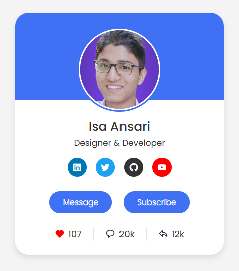

# Responsive Profile Card ✨

A modern, mobile-friendly profile card with interactive social buttons, built with HTML, CSS, and JavaScript.



## Features 🌟
- **Dynamic Like Button** ❤️  
  - Persistent like counter (saves with localStorage)
  - Heart icon animation
- **Social Media Integration**  
  - LinkedIn, Twitter, GitHub, YouTube links
- **Responsive Design** 📱  
  - Works on all screen sizes
- **Clean UI**  
  - Smooth hover effects
  - Professional color scheme

## Technologies Used 💻
- 
- 
- 
- 

## How to Use 🚀
1. Clone the repo:
   ```bash
   git clone https://github.com/your-username/responsive-profile-card.git
